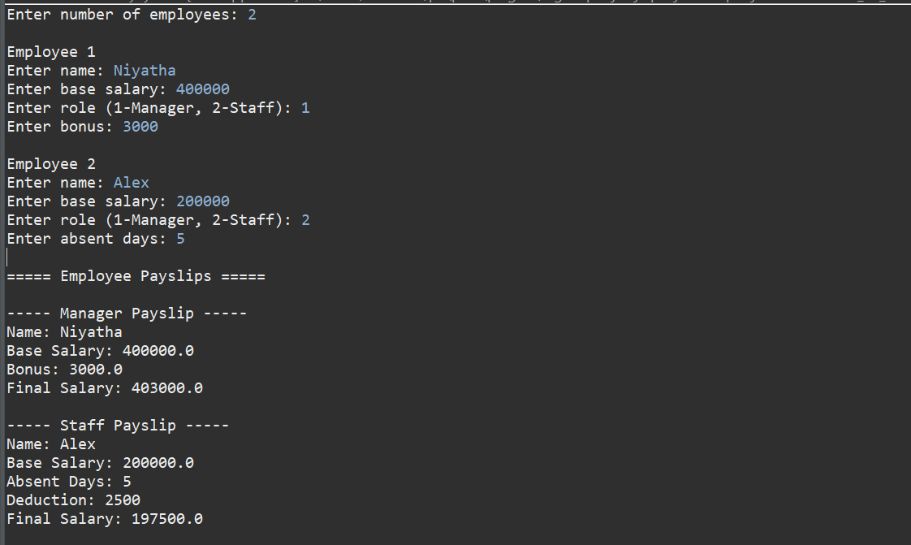

# Employee Salary Management System

##  Problem Statement

Develop a Java-based system to calculate employee salary based on role and attendance.

## Features

* Add employee details dynamically
* Support different roles (Manager, Staff)
* Salary calculation with bonus (Manager)
* Deduction based on absent days (Staff)
* Display detailed payslip
* Demonstrates inheritance and polymorphism

---

##  Technologies Used

* Java
* OOP Concepts (Inheritance, Polymorphism)
* ArrayList
* Scanner for user input

---

##  How to Run

1. Open Eclipse IDE
2. Create a Java Project
3. Add `SalarySystem.java`
4. Run as **Java Application**

---

## 📸 Output Screenshots

